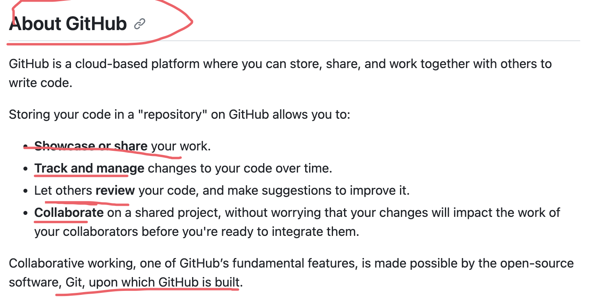
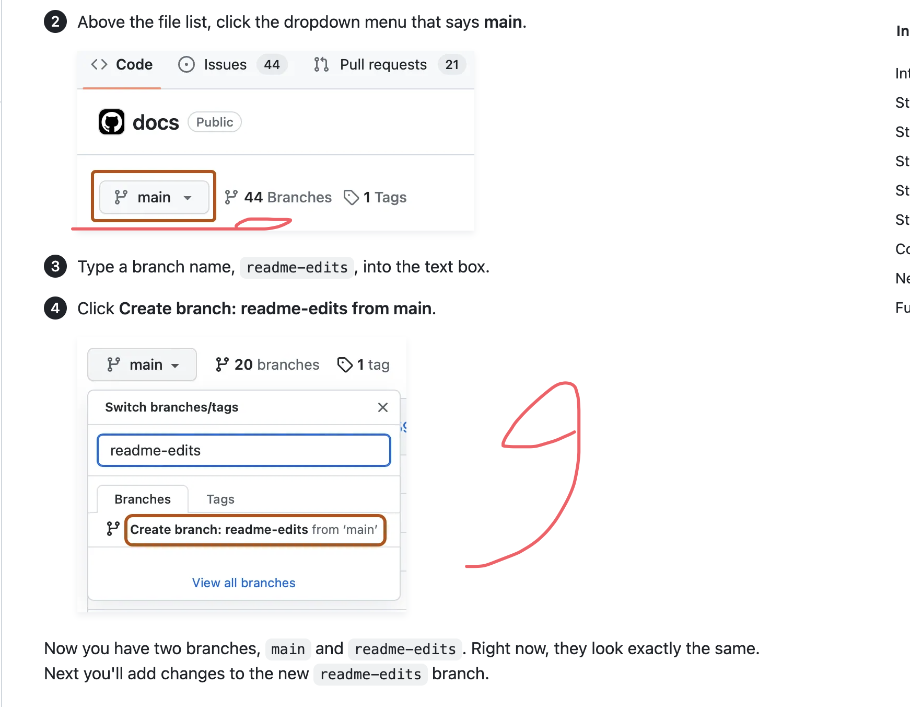

## How to learn git hub(https://docs.github.com/en/get-started)

## About GitHub

    
    
    
    
    
    
    
    
    

Show case and share 
Track and manage
let others review
Collaborate

## About Git

https://docs.github.com/en/get-started/using-git/about-git
Git and Github are different thing .
Git will automatically start to track and manage your changes.
// Git will automatically start to track and manage your changes.
There are plenty of Git-related actions that you can complete on GitHub directly in your browser, such as creating a Git repository, creating branches, and uploading and editing files.

// creating a Git repository, creating branches, and uploading and editing files.
Once you start to collaborate with others and all need to work on the same repository at the same time, you’ll continually:

Push back your own changes to the same remote repository on GitHub.
--*Pull*-- all the latest changes made by your collaborators from the remote repository on Github.
Pull all the latest changes made by your collaborators from the remote repository on Github.

When you created a new branch in the previous step, GitHub brought you to the code page for your new readme-edits branch, which is a copy of main.

// On Github, saved changes are called commits. Each commit has an associated commit message, which is a description 
explaining why a particular change was made. Commit messages capture the history of your changes so that other contributors can understand what you've done and why.
git markdown syntax
https://docs.github.com/en/get-started/writing-on-github/getting-started-with-writing-and-formatting-on-github/basic-writing-and-formatting-syntax

**This is a bold **

**Pull requests**  are the heart of collaboration on Github. When you open a pull request, you're proposing your changes and requesting  that someone review and pull in your contribution and merge them into their branch. Pull requests show diffs, or differences, of the content from both branches. The changes , additions, and subtractions are shown in different colors.

a *pull request*  may introduce changes to code that conflict with the existing code on main. If there are any conflicts, Github will alert you about the conflicting  code and prevent merging until the conflicts are resolved. You can make a commit that resolves the conflicts or use comments in the pull request to discuss the conflicts with your team members.

## Setting up your profile
**Share** your interests and skills.
_Showcase_ your projects and contributions.
~~Express~~ your identity and show the GitHub community who you are.
the algorithm of frontend
https://github.com/course-dasheng/fe-algorithm

开源软件许可证有多种类型,主要包括以下几种:

MIT许可证(MIT License)
Apache许可证(Apache License)
GNU通用公共许可证(GNU General Public License, GPL)
BSD许可证(Berkeley Software Distribution License)
Mozilla公共许可证(Mozilla Public License, MPL)
Eclipse公共许可证(Eclipse Public License, EPL)
Creative Commons许可证(Creative Commons Licenses)
MIT-Facebook专利许可证(MIT-Facebook Patent License)
ISC许可证(ISC License)
Unlicense
这些许可证在开放性、商业使用限制、专利授权等方面存在一些差异。开发者在选择开源许可证时,需要根据自己的需求和项目特点来权衡选择。不同类型的许可证适用于不同的场景。
