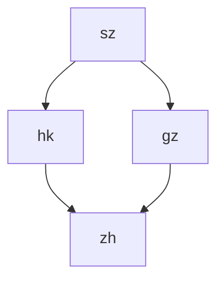

## [How to learn git hub](https://docs.github.com/en/get-started)
## [GitHub glossary](https://docs.github.com/en/get-started/learning-about-github/github-glossary)
## About GitHub
<p align="center">
    <a href="https://v3.vuejs.org/"></a>
    <a href="https://www.typescriptlang.org/"></a>
    <a href="https://vitejs.dev/"></a>
    <a href="https://router.vuejs.org/index.html"></a>
    <a href="https://pinia.vuejs.org/"></a>
    <a href="https://element-plus.gitee.io/en-US/"></a>
    <a href="http://en.sass.hk/"></a>
    
    
</p>
Check out this awesome image
let others review
Collaborate

## [About Git](https://docs.github.com/en/get-started/using-git/about-git)

Git and Github are different thing .
Git will automatically start to track and manage your changes.
// Git will automatically start to track and manage your changes.
There are plenty of Git-related actions that you can complete on GitHub directly in your browser, such as creating a Git repository, creating branches, and uploading and editing files.

// creating a Git repository, creating branches, and uploading and editing files.
Once you start to collaborate with others and all need to work on the same repository at the same time, you’ll continually:

provision


Push back your own changes to the same remote repository on GitHub.
--*Pull*-- all the latest changes made by your collaborators from the remote repository on Github.
Pull all the latest changes made by your collaborators from the remote repository on Github.

:sparkle:
When you created a new branch in the previous step, GitHub brought you to the code page for your new readme-edits branch, which is a copy of main.

// On Github, saved changes are called commits. Each commit has an associated commit message, which is a description 
explaining why a particular change was made. Commit messages capture the history of your changes so that other contributors can understand what you've done and why.
[git markdown syntax](https://docs.github.com/en/get-started/writing-on-github/getting-started-with-writing-and-formatting-on-github/basic-writing-and-formatting-syntax
)

**This is a bold **

**Pull requests**  are the heart of collaboration on Github. When you open a pull request, you're proposing your changes and requesting  that someone review and pull in your contribution and merge them into their branch. Pull requests show diffs, or differences, of the content from both branches. The changes , additions, and subtractions are shown in different colors.

a *pull request*  may introduce changes to code that conflict with the existing code on main. If there are any conflicts, Github will alert you about the conflicting  code and prevent merging until the conflicts are resolved. You can make a commit that resolves the conflicts or use comments in the pull request to discuss the conflicts with your team members.

## Setting up your profile
**Share** your interests and skills.
_Showcase_ your projects and contributions.
~~Express~~ your identity and show the GitHub community who you are.
前段算法课：<br>
<details>
1:[greatfrontend](https://www.greatfrontend.com/)<br>

2:[力扣](https://leetcode.cn/)

3:[leetcode](https://leetcode.com/)

4:[the algorithm of frontend](https://github.com/course-dasheng/fe-algorithm)
</details>


开源软件许可证有多种类型,主要包括以下几种:

MIT许可证(MIT License)
Apache许可证(Apache License)
GNU通用公共许可证(GNU General Public License, GPL)
BSD许可证(Berkeley Software Distribution License)
Mozilla公共许可证(Mozilla Public License, MPL)
Eclipse公共许可证(Eclipse Public License, EPL)
Creative Commons许可证(Creative Commons Licenses)
MIT-Facebook专利许可证(MIT-Facebook Patent License)
ISC许可证(ISC License)
Unlicense
这些许可证在开放性、商业使用限制、专利授权等方面存在一些差异。开发者在选择开源许可证时,需要根据自己的需求和项目特点来权衡选择。不同类型的许可证适用于不同的场景。
[Apple](https://www.apple.com/hk/)

## Work Flow
### 流程图
```flow
st=>start: Start
e=>end
op=>operation: My Operation
cond=>condition: Yes or No?

st->op->cond
cond(yes)->e
cond(no)->op
```
[马克飞象](https://maxiang.io/)

 ["Git Handbook"](https://guides.github.com/introduction/git-handbook/)
[GitHub flow](https://docs.github.com/en/get-started/using-github/github-flow)
example：[portfolio：](https://github.com/soumyajit4419/Portfolio)


To see how GitHub compares to GitLab, Bitbucket, and Jenkins, see Comparing GitHub to other DevOps solutions.


some interesting [theme](https://github.com/bep?tab=overview&from=2010-12-01&to=2010-12-31)
another :https://github.com/ssddanbrown

## ~deploy key~
A deploy key is an SSH key that is stored on your server and grants access to a single Github repository. This key is attached directly to the repository instead of to a personal user account.

<h1>Hello code</h1>

```<h1>Hello World</h1>```

### fork
A **fork** is a personal *copy* of another user's repository that lives on your account. Forks allow you to freely make changes to a project without affecting the original upstream repository. You can ~also~ open a pull request in the upstream repository and keep your fork synced with the lates changes since both repositories are still connnected.

## [jekyll](https://jekyllrb.com/)

## [git commands](https://git-scm.com/docs)

The background color is `#ffffff` for light mode and `#000000` for dark mode.

<div color=646CFF&logo=vite&logoColor=646CFF"; padding: 20px;">
Notice this content 
</div>


## [Keyboard shortcuts](Keyboard shortcuts)

Typing ? on GitHub brings up a dialog box that lists the keyboard shortcuts available for that page. You can use these keyboard shortcuts to perform actions across the site without using your mouse to navigate.
Typing ? on GitHub to find the keyboard shortcut.


## [GitHub Command Palette](https://docs.github.com/en/get-started/accessibility/github-command-palette)
> this is a important part of the GitHub

## [Quickstart for writing on GitHub](https://docs.github.com/en/get-started/writing-on-github/getting-started-with-writing-and-formatting-on-github/quickstart-for-writing-on-github)


## [.net| c#](https://dotnet.microsoft.com/en-us/apps/aspnet)


## [makrkown course](https://github.com/Charles2029/skills-communicate-using-markdown)

    


## [About writing and formatting on GitHub](https://docs.github.com/en/get-started/writing-on-github/getting-started-with-writing-and-formatting-on-github/about-writing-and-formatting-on-github)

---
>We've added some custom functionality to create GitHub Flavored Markdown, used to format prose and code across our site.
We've added some custom fuctionality to create GitHub Flavored Markdown, used to format prose and code across our site.
<!--this is very import message-->

 this is a code`hello`
This is red  `#FF0000` this is orange `#FFA500`

Notes:

A suppoted color model cannot have any leading or trailing spaces within the backticks.
The visualization of the color is only supported in issues, pull requests, and discussions.
[hello hk](https://www.discoverhongkong.com/eng/index.html?utm_campaign=HO_ALWAYSON&utm_source=GOOGLE_LH&utm_medium=CPC&utm_content=SEM-ALWAYSON_EN&utm_terms=hong%20kong%20tourism%20board&gad_source=1&gclid=CjwKCAjwydSzBhBOEiwAj0XN4MYiefLHxVxYTKQFQnVSzUsnwaVWZDExwXK5PUAEay9um_UNw1weZhoCufYQAvD_BwE)

 [GithubPages](https://pages.github.com/)

## Links
---
You can create an inline link by wrapping link text in brackets [ ], and then wrapping the URL in parentheses ( ). You can also use the keyboard shortcut Command+K to create a link. When you have text selected, you can paste a URL from your clipboard to automatically create a link from the selection.

You can also create a Markdown hyperlink by highlighting the text and using the keyboard shortcut Command+V. If you'd like to replace the text with the link, use the keyboard shortcut Command+Shift+V.

This site was built using [GitHub Pages](https://pages.github.com/).

Screenshot of rendered GitHub Markdown showing how text within brackets, "GitHub Pages," appears as a blue hyperlink.

Note: GitHub automatically creates links when valid URLs are written in a comment. For more information, see "Autolinked references and URLs."

When you use two or more headings, Github automatically generates a table of contents that you can access by clicking within the file header.Each heading title is listed in the table of 
contnets and you can click a title to navigate to the selected section.

Notice you can use `R` and `...`to quote something 
>Note: When viewing a conversation, you can automatically quote text in a comment by highlighting the text, then typing R. You can quote an entire comment by clicking , then Quote reply. For more information about keyboard shortcuts, see "Keyboard shortcuts."


<br>
This is a quote
Notes:A supported color model cannot have any leading or trailing spaces within the backticks.
The visualization of the color is only supported in issues,

[Basic writing and formatting syntax](https://docs.github.com/en/get-started/writing-on-github/getting-started-with-writing-and-formatting-on-github/basic-writing-and-formatting-syntax)
<br> 

[backticks](https://docs.github.com/en/get-started/writing-on-github/getting-started-with-writing-and-formatting-on-github/basic-writing-and-formatting-syntax)
this is whole [link](https://docs.github.com/en/get-started/writing-on-github/getting-started-with-writing-and-formatting-on-github/basic-writing-and-formatting-syntax)
<br>
[how to add a linke](https://docs.github.com/en/get-started/writing-on-github/getting-started-with-writing-and-formatting-on-github/basic-writing-and-formatting-syntax)
<h2>this is  a link tutorial</h2>

[links test](https://docs.github.com/en/get-started/writing-on-github/getting-started-with-writing-and-formatting-on-github/basic-writing-and-formatting-syntax)

[Contribution guidelines for this project](docs/CONTRIBUTING.md)
[index.md](/index.md)
- [ ] \(Optional) Open a followup issue


#1
🕘
 👍
 🏁
 
 [Emoji-Cheat-Sheet](https://github.com/ikatyang/emoji-cheat-sheet/blob/master/README.md).

 here is foot note[^1]
 here is another footnote [^2]
 >Notice
>[^1]: is very important
>[^2]: are also important
<br>

```
> [!NOTE]
> Useful information that users should know, even when skimming content.

> [!TIP]
> Helpful advice for doing things better or more easily.

> [!IMPORTANT]
> Key information users need to know to achieve their goal.

> [!WARNING]
> Urgent info that needs immediate user attention to avoid problems.

> [!CAUTION]
> Advises about risks or negative outcomes of certain actions.
```

>[!NOTE]
>THIS IS VERY IMPORTANT

>[!TIP]
>You should keep going on to finish your job

>[!IMPORTANT]
>Don't spend one dollar for woman

>[!WARNING]
>Remember the time

>[!CAUTION]
>There are many scamp in internet

You can ingnore \*some format in markdown~\* --back slash--

this one[ explain the method](https://daringfireball.net/projects/markdown/syntax#backslash)


Cells can vary in width and do not need to be perfectly aligned within columns. There must be at least three hyphens in each column of the header row.

//
>[!NOTE]
>Cells can vary in width and do not need to be perfectly aligned within columns. There must be at least three hyphens in each column of the
header row.
<details>

<summary>Tips for collapsed sections</summary>

### You can add a header

You can add text within a collapsed section. 

You can add an image or a code block, too.

```ruby
   puts "Hello World"
```

</details>

```ruby
require 'redcarpet'
markdown = Redcarpet.new("Hello World!")
puts markdown.to_html
```

```javascript
console.log("come to learn Github")
```

 
>[!TIPS]
>We use Linguist to perform language detection and to select third-party grammars for syntax highlighting. You can find out which keywords are valid in the languages YAML file.

Creating diagrams
You can also use code blocks to create diagrams in Markdown. GitHub supports Mermaid, GeoJSON, TopoJSON, and ASCII STL syntax. For more information, see "Creating diagrams."


[Creating diagrams](https://docs.github.com/en/get-started/writing-on-github/working-with-advanced-formatting/creating-diagrams)

## [ About creating diagrams](https://docs.github.com/en/get-started/writing-on-github/working-with-advanced-formatting/creating-diagrams)

~diagram~  rendring is available in GitHub Issues, Github Discussions, pull requests, wikis, and Markdown files.


Here is a simple flow chart:


```mermaid
   info
```


## Using GeoJSON
how to display a map , in markdown

```geojson
{
  "type": "FeatureCollection",
  "features": [
    {
      "type": "Feature",
      "id": 1,
      "properties": {
        "ID": 0
      },
      "geometry": {
        "type": "Polygon",
        "coordinates": [
          [
              [-90,35],
              [-90,30],
              [-85,30],
              [-85,35],
              [-90,35]
          ]
        ]
      }
    }
  ]
}
```

## Using TopoJSON
```topojson
{
  "type": "Topology",
  "transform": {
    "scale": [0.0005000500050005, 0.00010001000100010001],
    "translate": [100, 0]
  },
  "objects": {
    "example": {
      "type": "GeometryCollection",
      "geometries": [
        {
          "type": "Point",
          "properties": {"prop0": "value0"},
          "coordinates": [4000, 5000]
        },
        {
          "type": "LineString",
          "properties": {"prop0": "value0", "prop1": 0},
          "arcs": [0]
        },
        {
          "type": "Polygon",
          "properties": {"prop0": "value0",
            "prop1": {"this": "that"}
          },
          "arcs": [[1]]
        }
      ]
    }
  },
  "arcs": [[[4000, 0], [1999, 9999], [2000, -9999], [2000, 9999]],[[0, 0], [0, 9999], [2000, 0], [0, -9999], [-2000, 0]]]
}
```
## Creating STL 3D models
You can use ASCII STL syntax directly in markdown to create interactive 3D models. To display a model, add ASCII STL syntax inside a fenced code block with the stl syntax identifier. For more information, see "Creating and highlighting code blocks."

For example, you can create a simple 3D model:
```stl
solid cube_corner
  facet normal 0.0 -1.0 0.0
    outer loop
      vertex 0.0 0.0 0.0
      vertex 1.0 0.0 0.0
      vertex 0.0 0.0 1.0
    endloop
  endfacet
  facet normal 0.0 0.0 -1.0
    outer loop
      vertex 0.0 0.0 0.0
      vertex 0.0 1.0 0.0
      vertex 1.0 0.0 0.0
    endloop
  endfacet
  facet normal -1.0 0.0 0.0
    outer loop
      vertex 0.0 0.0 0.0
      vertex 0.0 0.0 1.0
      vertex 0.0 1.0 0.0
    endloop
  endfacet
  facet normal 0.577 0.577 0.577
    outer loop
      vertex 1.0 0.0 0.0
      vertex 0.0 1.0 0.0
      vertex 0.0 0.0 1.0
    endloop
  endfacet
endsolid
```

https://github.com/Charles2029/GitHub-learning-/blob/8bb62099d675d9acea56a7fb8709212207d84512/index.html#L6-L15

## [About GitHub CLI](https://docs.github.com/en/get-started/getting-started-with-git/set-up-git)


